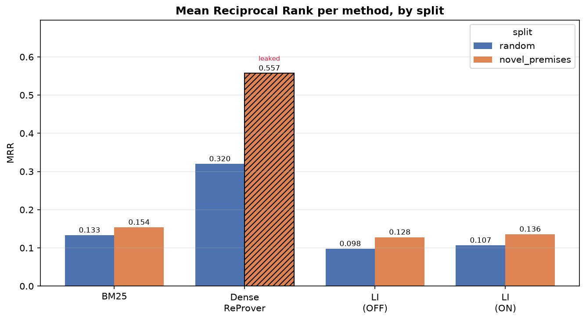

# ProofLens

**Premise-selection retrieval for formal theorem proving in Lean 4.**

Given a Lean 4 **proof state**, ProofLens ranks **premises** (lemmas, definitions, theorems) from
Mathlib so a prover can pick the right ones to make progress. Good premise selection is the known
bottleneck in scaling automated theorem proving: a prover that searches the whole ~180k-premise
library blindly is hopeless; a good retriever narrows it to a handful.

ProofLens is a **reproducible evaluation harness** plus three retrievers, all measured on the public
[LeanDojo Benchmark 4](https://leandojo.org/) (Mathlib4) on its `random` and `novel_premises` test
splits. Every retriever is scored behind one interface, with an **identical accessibility filter**
and **identical metrics**, so the comparison is valid.

## Retrievers

| Retriever | Config | Idea |
|---|---|---|
| **BM25** | `configs/bm25.yaml` | Sparse lexical baseline with a Lean-aware tokenizer (keeps identifiers/operators, splits dotted names). No training. |
| **Dense (ReProver)** | `configs/dense_reprover.yaml` | The official ReProver ByT5-small retriever checkpoint — one vector per state / premise, cosine similarity. Its encoding (masked-mean pooling, normalization, premise serialization) reproduces ReProver exactly, so its score calibrates the harness against published numbers. |
| **ProofLens-LI** | `configs/late_interaction.yaml` | Late-interaction (multi-vector) retriever via [PyLate](https://github.com/lightonai/pylate): one vector **per token**, scored by MaxSim, with an optional **symbol-anchored token weighting** that up-weights identifier/operator tokens in the MaxSim sum. |

The symbol weighting is a config flag (`symbol_weighting.enabled`) — `configs/late_interaction.yaml`
runs it off, `configs/late_interaction_weighted.yaml` runs it on — so the OFF-vs-ON comparison is a
one-line change. Both reuse the same premise index.

## Evaluation protocol

Mirrors ReProver so numbers are comparable to the literature:

- **One example** = one tactic's proof state that used at least one premise. Query = the
  `state_before`; gold = the premises that tactic used.
- Candidates are restricted to the **accessible** premises for that state — defined earlier in the
  same file, or in a (transitively) imported file — applied identically to every retriever.
- Retrieve the top **100**; report **Recall@1, Recall@10, MRR, nDCG@10** (and MAP), on the `random`
  and `novel_premises` test splits separately.

Metrics are pure, unit-tested functions. Every run writes a JSON with a full provenance header
(config, model id, dataset version, seed, split, counts) plus per-example records, and appends a row
to `summary.csv`; figures are rendered from that CSV.

## Results

Measured on LeanDojo Benchmark 4 (Lean 4), `random` and `novel_premises` test splits. Recall in %,
MRR/nDCG@10 as decimals; **bold** = our runs, *italic* = published reference.

| System | R@1 | R@10 | MRR | nDCG@10 |
|---|--:|--:|--:|--:|
| **— split: `random` (n = 2811) —** | | | | |
| BM25 | 5.48 | 13.63 | 0.133 | 0.105 |
| **Dense ReProver** | **13.04** | **38.59** | **0.320** | **0.283** |
| *ReProver (published, Lean 4)* | *13.42* | *39.60* | *0.328* | *—* |
| ProofLens-LI — weighting OFF | 4.15 | 10.44 | 0.098 | 0.078 |
| **ProofLens-LI — weighting ON** | **4.44** | **11.17** | **0.107** | **0.085** |
| **— split: `novel_premises` (n = 4357) —** | | | | |
| BM25 | 5.65 | 16.56 | 0.154 | 0.123 |
| Dense ReProver †&nbsp;*leaked* | 23.33 | 63.66 | 0.557 | 0.505 |
| *ReProver (published, clean-novel)* | *9.10* | *27.60* | *0.240* | *—* |
| ProofLens-LI — weighting OFF | 4.82 | 14.05 | 0.128 | 0.103 |
| **ProofLens-LI — weighting ON** | **5.21** | **14.53** | **0.136** | **0.108** |

**Key findings**

- **The harness is calibrated.** Our dense ReProver on `random` (13.04 / 38.59 / 0.320) matches the
  published Lean 4 reference (13.42 / 39.60 / 0.328) to within ~3% — confirming our measurement
  reproduces the field's protocol, so the rest of the numbers are trustworthy.
- **Symbol weighting helps.** Turning the symbol-anchored token weighting **on beats off on every
  metric, on both splits** (a ~3–9% relative lift) — evidence that Lean's symbol tokens carry the
  retrieval signal that late interaction can exploit.
- **A leakage trap, caught and quantified (†).** The only public ReProver checkpoint is trained on
  the `random` split, and the two splits share theorems — so **97.2%** of `novel_premises` test
  theorems sit in that model's training data (measured; control = 0.0%). Its `novel_premises` score
  is memorisation, not skill, and is flagged rather than reported.
- **Off-the-shelf late interaction is not yet competitive on Lean.** The general-purpose ColBERT
  model was never trained on mathematics, so it trails even BM25 — a clean, honest baseline (it still
  beats random chance ~400×) that motivates domain fine-tuning.

**Recall@1 and Recall@10, per method by split** (dense `novel_premises` bars hatched = leaked):


**Generalisation** — the trained dense retriever *drops* from `random` to `novel_premises` (using the
published clean-novel, since its own is leaked); the untrained methods *rise*:


**Ablation** — symbol-anchored token weighting OFF vs ON (only the token weights change between them):


**Mean Reciprocal Rank**, per method by split:



## Roadmap

The evaluation harness is the foundation; the natural next steps build directly on it.

- **Fine-tune the late-interaction retriever on Lean.** The off-the-shelf ColBERT embeddings cap the
  current gains; training on LeanDojo `(proof state, used-premise)` pairs with in-file hard negatives
  — where the symbol-anchored weighting can compound — is the path to making late interaction
  competitive with (and ideally beyond) the single-vector dense retriever.
- **Publish the fine-tuned retriever** (e.g. on Hugging Face) once trained, so others can reuse it.
- **Tune and extend the symbol weighting** — sweep the weights, refine the symbol/filler token
  classification, and align it more precisely to Lean's token classes.
- **Broaden the evaluation** — extra cut-offs (R@5, R@100, MAP), error analysis of where retrieval
  fails, and per-premise-type breakdowns. The harness already stores the full ranked list per
  example, so new metrics need no re-runs.
- **Close the loop with a prover** — feed retrieved premises into a tactic generator and measure
  end-to-end proof success, the ultimate downstream signal.

## Layout

```
configs/            # one YAML per retriever (model id, index dir, k-list, seed, tokenizer/weighting)
src/prooflens/
  data/             # corpus.jsonl -> Premise objects + import graph; accessibility; proof-split loaders
  retrievers/       # base interface + bm25, dense (ReProver), late_interaction (+ symbol weighting)
  eval/             # metrics (pure, unit-tested) + evaluation loop
  utils/            # io, seeding, logging
scripts/            # download_data, build_index, run_eval, plot_results
slurm/              # batch submission scripts for a Slurm cluster
tests/              # metrics, loaders, accessibility, per-retriever, end-to-end smoke (+ tiny fixtures)
```

## Installation

Requires Python 3.11+.

```bash
python -m venv .venv
source .venv/bin/activate          # Windows: .venv\Scripts\activate
pip install -r requirements.txt
```

The dense and late-interaction retrievers need `torch`, `transformers`, and `pylate`; BM25 and the
test suite need none of those. Install what you use.

## Quick start

Run the unit tests (no downloads, no GPU — they use tiny bundled fixtures):

```bash
pytest
```

## Running an evaluation

1. **Stage the data and checkpoints** (once). `download_data.py` fetches LeanDojo Benchmark 4
   (MD5-verified) and the model checkpoints:

   ```bash
   python scripts/download_data.py --out /path/to/data                 # everything
   python scripts/download_data.py --out /path/to/data --only benchmark
   ```

   Point the configs at your paths via environment variables:

   ```bash
   export DATA_ROOT=/path/to/data/leandojo_benchmark_4
   export MODELS_DIR=/path/to/data/models
   export SCRATCH=/path/to/scratch            # where indices are written
   ```

2. **Build the index** (tokenize for BM25; encode premises for dense/LI):

   ```bash
   python scripts/build_index.py --config configs/bm25.yaml
   ```

3. **Evaluate:**

   ```bash
   python scripts/run_eval.py --config configs/bm25.yaml
   python scripts/run_eval.py --config configs/dense_reprover.yaml
   python scripts/run_eval.py --config configs/late_interaction.yaml
   python scripts/run_eval.py --config configs/late_interaction_weighted.yaml
   ```

   Useful flags: `--split random|novel_premises` (evaluate one split), `--limit N` (first N examples,
   for a quick sanity check), `--results-dir DIR`.

4. **Render figures** from the accumulated results:

   ```bash
   python scripts/plot_results.py --summary results/metrics/summary.csv --out results/figures
   ```

### On a cluster (Slurm)

The dense and late-interaction retrievers encode the full corpus and want a GPU. `slurm/` has ready
jobscripts — stage everything on a login node first (compute nodes are typically offline), convert
line endings (`dos2unix slurm/*.sh`), then:

```bash
sbatch slurm/build_index.sh configs/bm25.yaml        # CPU indexing
sbatch slurm/run_eval.sh     configs/dense_reprover.yaml   # GPU evaluate
```

Adjust partition names, account, and paths at the top of each script for your cluster.

## Configuration

Each retriever is driven entirely by its YAML (model id, index directory, `k`-list, batch size,
seed, tokenizer settings, and for LI the symbol-weighting toggle and weights). Paths use environment
variables (`${DATA_ROOT}`, `${MODELS_DIR}`, `${SCRATCH}`) so the same config runs anywhere. Nothing
is hard-coded in the code.

## Development

```bash
ruff check .
pytest
```

## References

ProofLens builds on and is measured against:

- **LeanDojo** (benchmark + ReProver retriever) — Yang et al., 2023, *LeanDojo: Theorem Proving with
  Retrieval-Augmented Language Models* ([arXiv:2306.15626](https://arxiv.org/abs/2306.15626)).
- **ColBERT** late interaction — Khattab & Zaharia, 2020 — via **PyLate**.
- Dense checkpoint: [`kaiyuy/leandojo-lean4-retriever-byt5-small`](https://huggingface.co/kaiyuy/leandojo-lean4-retriever-byt5-small).
  Late-interaction checkpoint: [`lightonai/GTE-ModernColBERT-v1`](https://huggingface.co/lightonai/GTE-ModernColBERT-v1).

## License

Released under the MIT License — see `LICENSE`.
