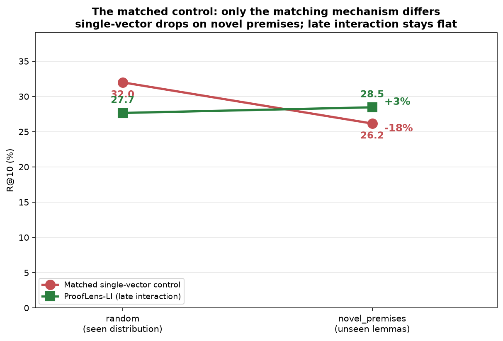
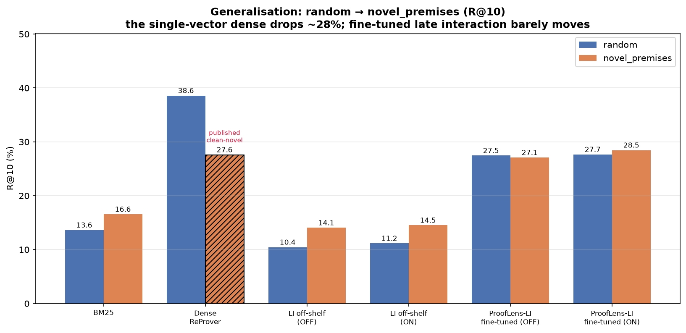
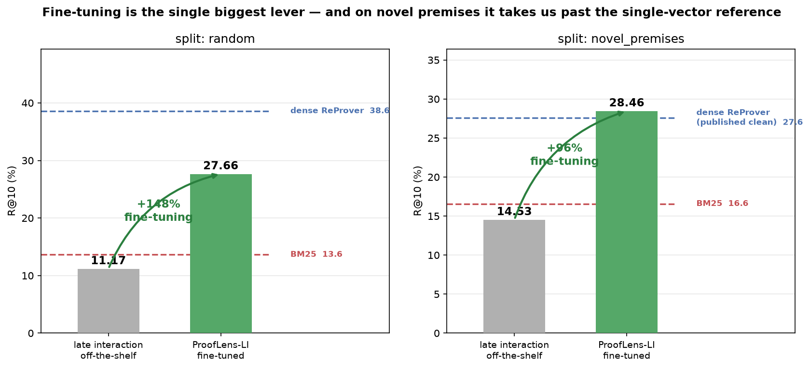
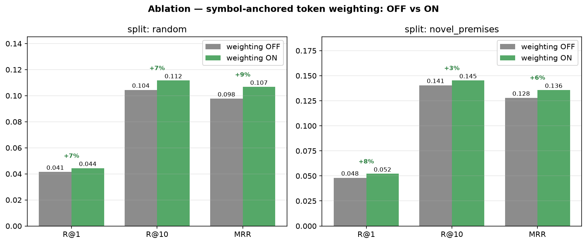
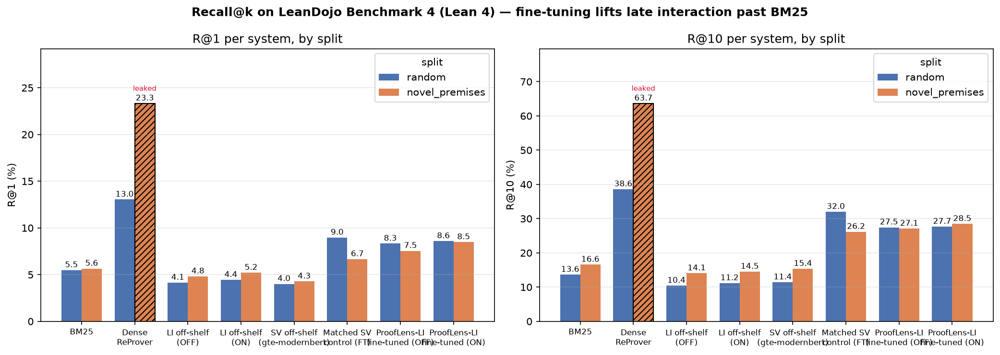

# ProofLens

**Finding the right lemma, at the right moment, in a library of 180,000.**

ProofLens is a premise-selection retriever for formal theorem proving in Lean 4. Given a **proof
state**, it ranks **premises** (lemmas, definitions, theorems) from Mathlib so a prover can pick the
one that moves the proof forward. Premise selection is the bottleneck in scaling formal proof.

---

## Hypothesis

> **Every published Lean retriever pools a premise into a single vector, which blurs the exact
> symbols formal matching depends on. Keeping one vector *per token* and matching at the token level
> ("late interaction") — with the symbol tokens up-weighted — should preserve that structure and
> generalise better to *novel* premises the model never saw in training.**

**Verdict:** supported as a **robustness** claim, not an absolute-accuracy one. With every confound
removed by a matched control over **5 training seeds**, late interaction generalises better
(single-vector drops −17.9% on novel premises; late interaction stays flat, and wins on novel in
**5/5 seeds**) — but it *loses* on the easy `random` split, and its edge is **largely lexical** rather
than deeply structural. All of this is measured below, honestly.

---

## The mechanism

**Single-vector (what everyone does):** average the token vectors into one, score by cosine — fast,
but a lossy compression that blurs the one decisive token.

**Late interaction (ours):** keep all token vectors; score with **MaxSim**, our twist being the
weight `w(i)` that up-weights a query's most discriminative tokens (set from each token's corpus IDF):

$$\text{score}(s, p) = \sum_i \; w(i)\cdot \max_j \; \text{sim}\big(E_s[i],\, E_p[j]\big)$$

Set `w(i)=1` and this is standard ColBERT — so the twist is arithmetic over the score, not a new
model, and the ablation is a single flag flip.

---

## Results

All numbers are on [LeanDojo Benchmark 4](https://leandojo.org/) (Mathlib4), both official test
splits, through **one frozen harness** with an identical accessibility filter and metrics for every
system. Recall in %. `random` n=2,811; `novel_premises` n=4,357. The two fine-tuned rows are **means
over 5 training seeds**; the rest are single-seed (42).

### Headline table

| System | Trained on Lean? | random R@1 | random R@10 | novel R@1 | novel R@10 |
|---|:--:|--:|--:|--:|--:|
| BM25 (lexical baseline) | no | 5.48 | 13.63 | 5.65 | 16.56 |
| Late interaction, off-the-shelf | no | 4.15 | 10.44 | 4.82 | 14.05 |
| Single-vector, off-the-shelf (gte-modernbert) | no | 4.01 | 11.41 | 4.28 | 15.36 |
| Dense ReProver (published single-vector) | yes | 13.04 | **38.59** | — | *27.6*¹ |
| **Matched single-vector control, fine-tuned** | yes | **8.92** | **32.29** | 7.04 | 26.51 |
| **ProofLens-LI, fine-tuned + IDF weighting** | yes | 8.48 | 28.10 | **8.63** | **29.05** |

<sub>¹ No *clean* dense number is obtainable on `novel_premises` from the public checkpoint (see
[The leak we caught](#the-leak-we-caught)) — we cite ReProver's published figure. Every other cell is
our harness. Our calibration gate: dense ReProver on `random` = 38.59 vs published 39.60 (~3%).</sub>

### The matched control — the result the project was built to test

Trained our **own** single-vector model on the **identical everything** — same triplets, hard
negatives, base lineage (`gte-modernbert-base`), budget, learning rate (3e-6), frozen harness. The
**only** difference is single-vector cosine vs multi-vector MaxSim.



Mean ± std over **5 training seeds** (42, 1, 2, 3, 4):

| System (fine-tuned, everything matched) | random R@10 | novel R@10 | Gap |
|---|--:|--:|--:|
| **Matched single-vector control** | **32.29 ± 0.53** | 26.51 ± 0.68 | **−17.9%** ⬇ (≈6.7σ) |
| **ProofLens-LI (late interaction)** | 28.10 ± 0.31 | **29.05 ± 0.27** | **+3.4%** ⬆ |

The lines cross: single-vector drops ~18% seen→unseen (also on R@1 and MRR); late interaction does
not. And per-seed, **late interaction beats the matched control on novel premises in 5 out of 5
independent training runs**, significant in every one (R@10 Δ +1.45 to +3.38, mean +2.54). **Two
independent single-vector systems collapse on novel** — ours (−17.9%) and published dense ReProver
(38.59→27.6, −28%) — late interaction is the only trained system that holds. It is also **2–5× more
stable across seeds** (std 0.13–0.31 vs 0.53–0.68). Nuance: single-vector *wins* on `random`
(32.3 vs 28.1), so the claim is **robustness, not a blanket win**.



### Fine-tuning — the single biggest lever (~2.5×)

| Split | Metric | Off-the-shelf | Fine-tuned | Change |
|---|---|--:|--:|--:|
| random | R@10 | 11.17 | 27.66 | **+148%** |
| random | MRR | 0.107 | 0.236 | **+121%** |
| novel | R@10 | 14.53 | 28.46 | **+96%** |
| novel | MRR | 0.136 | 0.240 | **+76%** |

One epoch on a single GPU takes off-the-shelf ColBERT (which *loses to BM25*) to ~2× BM25.



### Symbol weighting — a significant, data-derived lift, concentrated on novel premises

Turning the token weighting **on vs off**, paired over the per-example records (bootstrap 95% CI +
sign-flip permutation; ✅ = CI excludes 0 **and** p < 0.05):

| split | R@1 | R@10 | MRR | nDCG@10 |
|---|--:|--:|--:|--:|
| **novel** | +0.93 ✅ | +1.38 ✅ | +1.58 ✅ | +1.34 ✅ |
| random | +0.27 | +0.21 | +0.79 ✅ | +0.39 ✅ |

(percentage-point lift; all p ≤ 2e-4 on novel.) On **novel premises every metric improves
significantly**; on `random`, only the ranking-quality metrics (MRR, nDCG) do. So the weighting
reliably lifts *where* the gold premise ranks on both splits, and *whether* it enters the top-k on
novel — exactly where symbolic precision matters most and a premise cannot be memorised. The ablation
is clean by construction: on and off reuse the same premise index *and* query vectors, so only the
token weights differ.

The reported system sets the weight from each token's **corpus IDF instead of a hand-picked
constant** — data-derived and, being scale-invariant, tuning-free. IDF matches or beats the old
constant (novel MRR +0.70, p = 0.008), so there is no tuned magic number left in the score.



### Is the advantage structural, or a "neural BM25"? — mostly lexical (honest)

Splitting novel examples by whether the gold lemma's name appears in the state, LI vs the matched
control, example-paired:

| Novel examples | n | LI R@10 | SV R@10 | LI − SV |
|---|--:|--:|--:|--:|
| **Lexical** (gold name in state) | 1,158 (27%) | 30.6 | 24.1 | **+6.5** ✅ sig |
| **Structural** (name *not* in state) | 3,199 (73%) | 27.7 | 26.9 | +0.8 ❌ tied |

Late interaction's edge is **recovering token-level lexical overlap that pooling averages away** —
significant where a shared symbol exists, statistically tied on the structural 73%. We claim it at
that strength and no higher.



### Part 4 — does better retrieval improve *proving*? (downstream tactic generation)

We hold ReProver's tactic generator **fixed** and vary only which retriever fills its context, then
measure whether the generated next-tactic matches the human's. `match@k` = exact-tactic match (a
lower bound); `premise_name@k` = the tactic names a gold premise (an upper bound). Neither is a
proof-success rate. Premises come from each retriever's persisted top-k (no re-retrieval).

**`novel_premises` (n=4,357)** — % :

| condition | match@1 | match@8 | premise_name@1 | premise_name@8 |
|---|--:|--:|--:|--:|
| none (floor) | 0.41 | 2.50 | 5.12 | 23.98 |
| BM25 | 1.06 | 4.73 | 8.12 | 30.80 |
| **FT-LI (ours)** | 1.24 | **6.11** | **9.23** | **35.94** |
| FT-SV (control) | **1.40** | 5.81 | 9.07 | 35.80 |

**`random` (n=2,811)** — %:

| condition | match@1 | match@8 | premise_name@1 | premise_name@8 |
|---|--:|--:|--:|--:|
| none (floor) | 0.39 | 1.81 | 3.81 | 19.89 |
| BM25 | 1.28 | 3.91 | 7.58 | 26.36 |
| **FT-LI (ours)** | **1.74** | 5.51 | **9.57** | 33.26 |
| FT-SV (control) | 1.64 | **5.59** | 8.79 | **33.72** |

- **Retrieval clearly helps proving:** every retriever beats the no-premises floor on every metric,
  both splits, paired **p = 0.0001** (premise_name@8: ~20–24% → **33–36%**). The retrieval→proving
  link, shown without a live prover.
- **FT-LI and FT-SV tie downstream on both splits** (ns everywhere). The retrieval-level difference
  between two well-fine-tuned retrievers is below the generator's resolution — honest, in both
  directions (SV leads at retrieval on `random`, LI on `novel`; neither lead survives).

---

## The leak we caught

Calibrating, the public dense ReProver checkpoint scored **63.7 R@10 on `novel_premises`** — >2× the
published 27.6, and *higher than its own `random` score*, which should be impossible. It is **not a
harness bug**: `random` and `novel_premises` are two partitions of the **same theorem pool**, so a
checkpoint trained on one split's train set has already seen most of the *other* split's test
theorems. This is the exact memorization the LeanDojo authors designed the novel split to prevent.

**Direct, falsifiable test** (`scripts/leakage_stratified.py`) — split `novel/test` by whether each
theorem is in `random/train`, re-score the same records:

| Group | n | R@10 | 95% CI |
|---|--:|--:|--:|
| **LEAKED** — theorem ∈ `random/train` | 4,284 | **64.12%** | — |
| **CLEAN** — never trained on | 73 | **37.04%** | [27.5, 46.6] |

A 27-point gap (~4.8 SE, p < 1e-5); the clean CI contains the published 27.6. We **do not** substitute
37.04 as "the clean number" (a second, premise-level channel remains, and it would flatter our thesis
for the wrong reason) — which is exactly why the **matched control** (trained by us, leak-free by
construction) is the load-bearing result. None of our fine-tuned numbers carry this contamination.

---

## Where we fall short

1. **Loses on `random`** to both single-vector systems — the claim is robustness, not absolute
   accuracy. Likely undertrained (1 epoch, 4.8 GB of a 48 GB GPU), a BPE tokenizer that fragments
   Lean unicode, and a negative-sampling recipe now known to be suboptimal (7).
2. **The advantage is largely lexical**, not demonstrated structural reasoning (§ above).
3. **"Novel premises" ≠ "novel symbols"** — Mathlib names are compositional; LI may win by
   compositional lexical matching (a narrower claim).
4. **Downstream tie** — the retrieval edge does not separate LI from single-vector once fed to a
   generator (Part 4).
5. ~~Symbol weight is hand-set~~ **— resolved.** The weight is now each token's **corpus IDF**
   (data-derived, scale-invariant, tuning-free), not a hand-picked constant; it matches or beats the
   old `w=4.0` (novel MRR +0.70, p = 0.008). A *learned* saliency head remains possible future work.
6. ~~Single seed / no significance~~ **— resolved.** The matched control is now 5 seeds (mean ± std,
   5/5 seeds significant), and every headline comparison carries a paired bootstrap CI + permutation
   p-value.
7. **The training recipe is suboptimal.** A negatives ablation found BM25 hard negatives *hurt*
   versus random negatives (R@1 −1.40, MRR −1.88, both p<0.002; R@10 borderline) — plausibly
   false-negative contamination, since lexically similar Mathlib premises are often valid but
   unlabelled. Our reported LI numbers are ~1–1.9 pts conservative. Whether the single-vector control
   would gain equally is **unmeasured**.
8. **Late interaction is expensive** — ~69× the index footprint of single-vector; latency untested.
9. **No live prover** — downstream is offline next-tactic prediction; end-to-end proof search was
   blocked by a lean-dojo/Lean-4.20 REPL incompatibility.

---

## Status

| Part | State |
|---|---|
| **1 — Harness & baselines** | ✅ **Complete** — calibrated (~3% of published), leakage caught & quantified |
| **2 — Fine-tuning & the central experiment** | ✅ **Complete** — 2.5× lift; matched control over **5 seeds** (thesis holds, 5/5 significant); IDF weighting, ablation significance, negatives ablation all done |
| **3 — Win outright** | 📋 Future work — bigger budget, Lean-aware/byte-level tokenizer, learned saliency, random-negative recipe |
| **4 — Close the loop with a prover** | 🔄 Downstream eval **complete**; live proof search blocked by a lean-dojo/Lean-4.20 REPL incompatibility (env work done, resumable) |

---

## Repository layout

```
configs/            # one YAML per experiment (train/ = fine-tuning recipes; generate/ = Part 4)
src/prooflens/
  data/             # corpus + import graph, accessibility, proof splits, training-pair mining, audit
  retrievers/       # bm25, dense (ReProver + single-vector), late_interaction (+ symbol weighting)
  generation/       # ReProver tactic generator + input formatting (Part 4)
  eval/             # metrics (pure, unit-tested) + retrieval & generation eval loops
  utils/            # io, seeding, logging
scripts/            # download_data, build_index/pairs, build_token_idf, train_li/sv, run_eval,
                    # run_generate, significance, expand_metrics, generation_compare,
                    # leakage/lexical stratification, plot_results
slurm/              # cluster jobscripts
tests/              # 259 tests: metrics, loaders, accessibility, every retriever, generation, stats
```

## Getting started

Requires Python 3.10+.

```bash
python -m venv .venv
source .venv/bin/activate          # Windows: .venv\Scripts\activate
pip install -r requirements.txt
pytest                             # 259 tests — no downloads, no GPU (tiny bundled fixtures)
```

```bash
# Stage data + checkpoints, then evaluate any system through the frozen harness
python scripts/download_data.py --out /path/to/data
export DATA_ROOT=/path/to/data/leandojo_benchmark_4 MODELS_DIR=/path/to/data/models
python scripts/run_eval.py       --config configs/late_interaction_ft_random_weighted.yaml
python scripts/run_generate.py   --config configs/generate/gen_ft_li_novel.yaml   # Part 4
python scripts/plot_results.py                                                    # figures
```

On a cluster, `slurm/` has ready jobscripts (`dos2unix` them first).

---

## References

- **LeanDojo / ReProver** — Yang et al., 2023 ([arXiv:2306.15626](https://arxiv.org/abs/2306.15626)) —
  the benchmark and the single-vector retriever we calibrate against.
- **ColBERT** (late interaction) — Khattab & Zaharia, 2020 — via [PyLate](https://github.com/lightonai/pylate).
- Checkpoints: [`kaiyuy/leandojo-lean4-retriever-byt5-small`](https://huggingface.co/kaiyuy/leandojo-lean4-retriever-byt5-small),
  [`lightonai/GTE-ModernColBERT-v1`](https://huggingface.co/lightonai/GTE-ModernColBERT-v1),
  [`kaiyuy/leandojo-lean4-retriever-tacgen-byt5-small`](https://huggingface.co/kaiyuy/leandojo-lean4-retriever-tacgen-byt5-small).

## License

MIT — see `LICENSE`.
